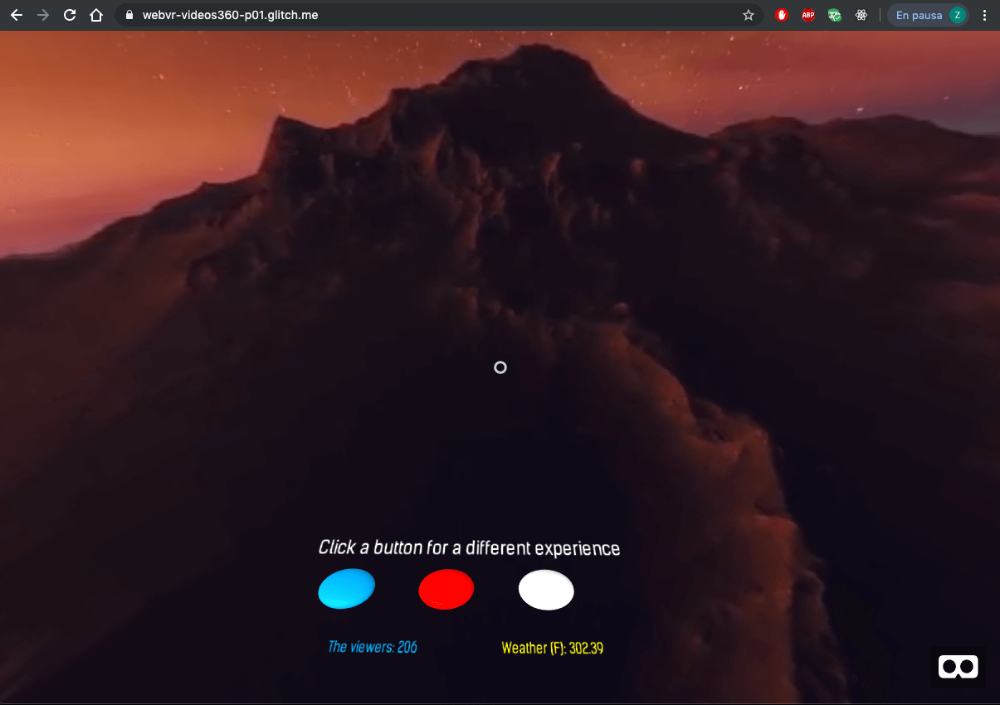

# First WebVR

This is the first team project from the Coding Bootcamp. This is our first approach to WebVR using the framework A-Frame in this you can choice between three experiences in 360º. We include the use of external API that provide the wather and connection to Firebase for count the number of viewers.

## Live test

This project is available online in Glitch platform, [click here to go](https://webvr-videos360-p01.glitch.me/). We decide use Glitch instead of GitHub because Glitch provides a standar back-end for VR projects. This could be tested in desktop and other device like Oculus or Cardboard.

The page provide you three buttons with different 360º videos in each one, this menu is always visible in the bottom to jump in to other experiencia and watch the weather and viewers

### Local test

If you want run local this project, just download the project from Glitch and run the back-end server you prefer, in the developing process we use a HTTP simple server with python, is easy just open your local terminal and run the command line `python -m http.server` and open your browser in the localhost 8000 (this port is provided by default) and that's all

## Built With

For this project we use:

- [A-Frame](https://aframe.io/) - Framework to develope webVR from a plain HTML file
- JavaScript - For the buttons interactivity
- [API Open Weather](https://openweathermap.org) - API that brings the local weather
- [Firebase](https://firebase.google.com/) - A live database that count the viewers
- Ajax - Used with the ´GET´ method for the API